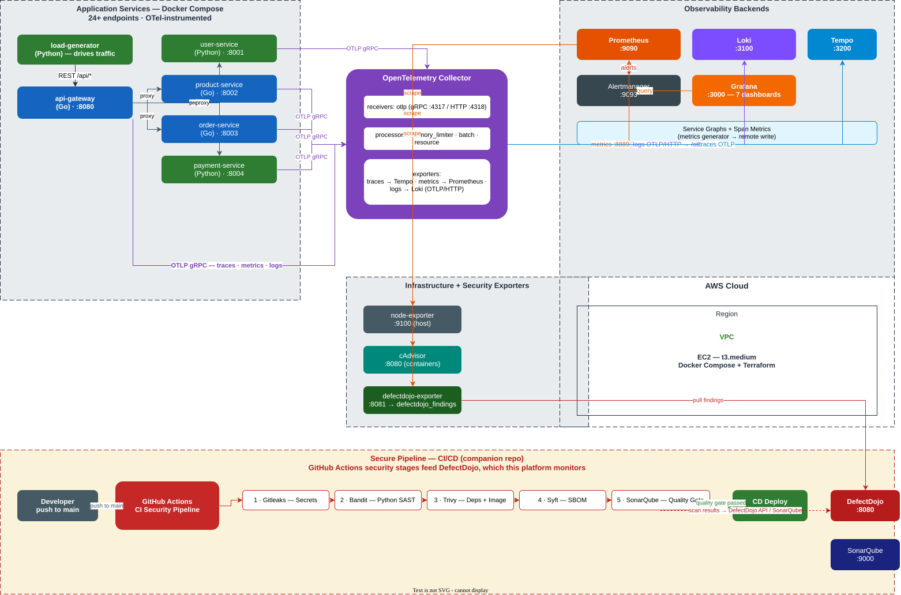

# Monitor Secure Pipeline

[](https://github.com/wazaglo/monitor-secure-pipeline/actions/workflows/ci.yml)
[](LICENSE)

> **Author: Wisdom Azaglo**

An end-to-end **observability platform** for the
[secure-pipeline](https://github.com/wazaglo/secure-pipeline) DevSecOps CI/CD stack.
It monitors **24+ API endpoints** across **5 OTel-instrumented microservices** plus the
security tooling (DefectDojo, SonarQube) using **Prometheus**, **Grafana**, **Loki**,
**Tempo**, the **OpenTelemetry Collector**, and **Alertmanager** — everything in **Docker**, no Kubernetes.

```
       load-generator
            │  HTTP + W3C trace context
            ▼
  ┌── api-gateway ──┐   (24+ endpoints)
  ▼       ▼       ▼
 user   product  order──payment
 service service service──service
            │  OTLP (traces + metrics + logs)
            ▼
    ┌── otelcol ──────┐
    ▼     ▼      ▼    ▼
 Prometheus   Loki   Tempo ──┐
    │         (no    │       │ (service graphs + span metrics)
    │        Promtail) │       ▼
    └──── Grafana ◄────┘  remote write → Prometheus
              ▲
              └──── Alertmanager
```

**The companion project** [secure-pipeline](https://github.com/wazaglo/secure-pipeline) is a
security-first CI/CD pipeline (Gitleaks → Bandit → Trivy → Syft → SonarQube → DefectDojo)
deployed to AWS EC2 via Terraform. This repository observes it — and the demo microservice
stack that exercises the pipeline's CI checks.

---

## What's inside

| Capability | Tooling | Details |
| ---------- | ------- | ------- |
| Metrics | Prometheus + OpenTelemetry | Service metrics via OTLP (`http_requests_total`, `orders_created_total`, latency histograms), infra via node-exporter + cAdvisor |
| Logs | Loki (no Promtail) | Every app logs via OTel → otelcol → Loki `/otlp`; `service_name` labeled |
| Traces | Tempo | OTLP traces, distributed tracing across gateway + backends, service graphs, span metrics |
| Alerting | Alertmanager + Prometheus | 16 rules: services, application, infrastructure, telemetry, security |
| Dashboards | Grafana | 7 pre-provisioned dashboards + Tempo service map |
| Security | DefectDojo exporter | `defectdojo_findings{severity}` published to Prometheus |

## The 5 microservices

| Service | Language | Port | Endpoints |
| ------- | -------- | ---- | --------- |
| api-gateway | Go 1.25 | 8080 | 13+ routes, proxies `/api/products`, `/api/orders`, `/api/users`, `/api/payments`, `/api/inventory`, `/api/health`, ... |
| user-service | Python | 8001 | users CRUD + auth |
| product-service | Go 1.25 | 8002 | products + stock |
| order-service | Go 1.25 | 8003 | orders, places payments |
| payment-service | Python | 8004 | payments, refunds, webhooks |
| load-generator | Python | — | 30 weighted calls/min exercising all 24+ endpoints |

All services are instrumented with OpenTelemetry (OTel SDK + `otelhttp` / `otelslog` / `opentelemetry-python`)
and export traces, metrics, and logs over **OTLP/HTTP** to a single `otelcol` collector.

## Quickstart

```bash
git clone https://github.com/wazaglo/monitor-secure-pipeline.git
cd monitor-secure-pipeline
cp .env.example .env
docker compose up -d --build
```

| Service | URL |
| ------- | --- |
| Grafana | http://localhost:3000 (`admin`/`admin`) |
| Prometheus | http://localhost:9090 |
| Loki | http://localhost:3100 |
| Tempo | http://localhost:3200 |
| Alertmanager | http://localhost:9093 |
| API Gateway | http://localhost:8080/api/info |
| OTel Collector metrics | http://localhost:8889/metrics |

You should see **8/8 scrape targets UP** in Prometheus, **7 dashboards** in Grafana,
logs streaming into Loki from all 6 services, and distributed traces in Tempo within a minute.

## Architecture



See [docs](docs/docs/architecture.md) for the full walkthrough of how metrics, logs, and traces
flow from the apps through the collector and into the storage backends.

## Alerting

16 rules in `monitoring/prometheus/rules.yml`:

- **Services** — instance down, high latency
- **Application** — no orders/payments created (`OrderFailures`, `PaymentFailures`), low stock
- **Infrastructure** — high CPU/memory/disk
- **Telemetry** — metrics/logs/traces pipeline down, low trace volume
- **Security** — high-severity DefectDojo findings

## AWS EC2 deployment

[Terraform](terraform/) provisions a single EC2 instance running the whole stack via Docker
Compose (see `user-data.sh`):

```bash
cd terraform
cp terraform.tfvars.example terraform.tfvars
terraform init && terraform apply
```

## Repository layout

```
services/           5 OTel-instrumented microservices + load-generator
monitoring/         prometheus, loki, tempo, otelcol, alertmanager, grafana (provisioned), exporters
  exporters/defectdojo-exporter/  DefectDojo findings → Prometheus
terraform/          EC2 deployment (main.tf, user-data.sh)
docs/               MkDocs site + runbooks (incident response, service down, disk full, ...)
.github/workflows/  CI: compose + promtool + otelcol validation
```

## Documentation

Full docs (MkDocs): [docs/docs/index.md](docs/docs/index.md)

- [Quickstart](docs/docs/quickstart.md)
- [Architecture](docs/docs/architecture.md)
- [Dashboards](docs/docs/dashboards.md)
- [Alerts](docs/docs/alerts.md)
- [Runbooks](docs/docs/runbooks/) — service down, disk full, high error rate, slow traces
- [Deploy to AWS](docs/docs/deploy.md)

## License

MIT
